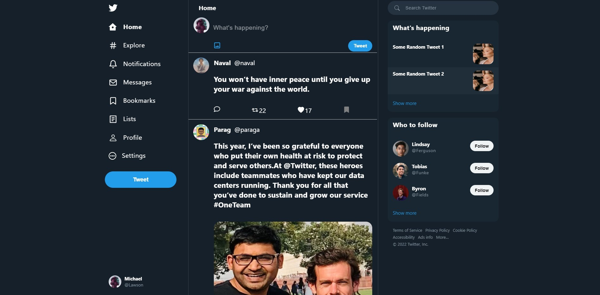
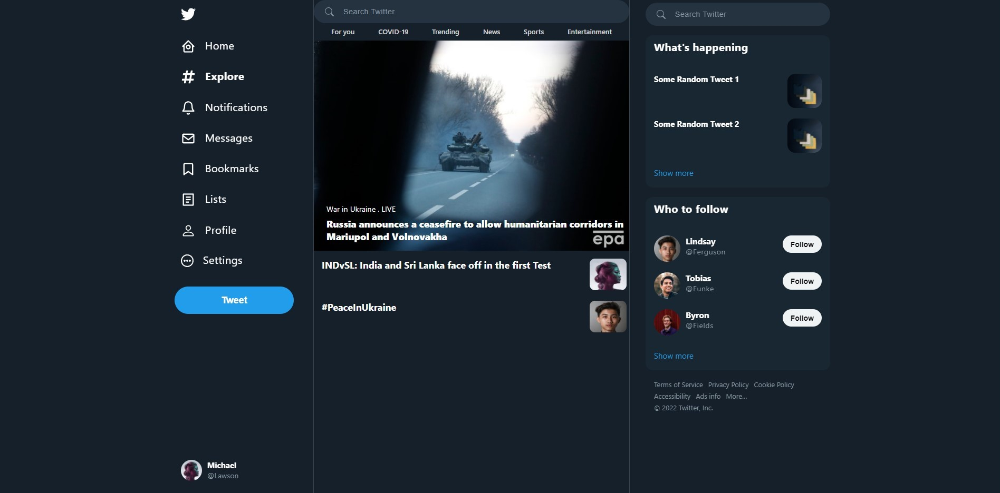
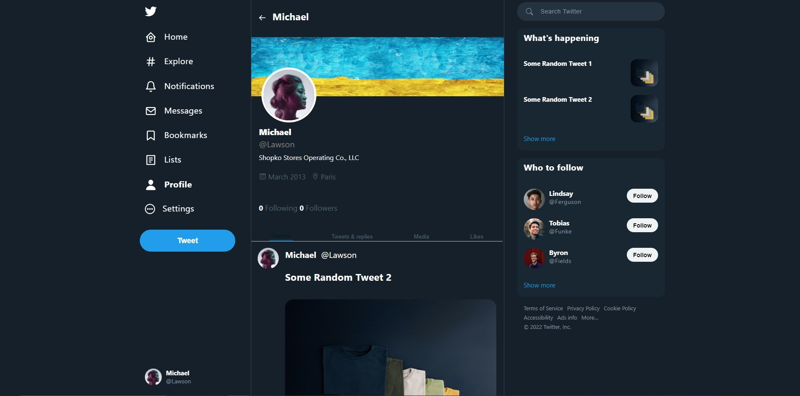
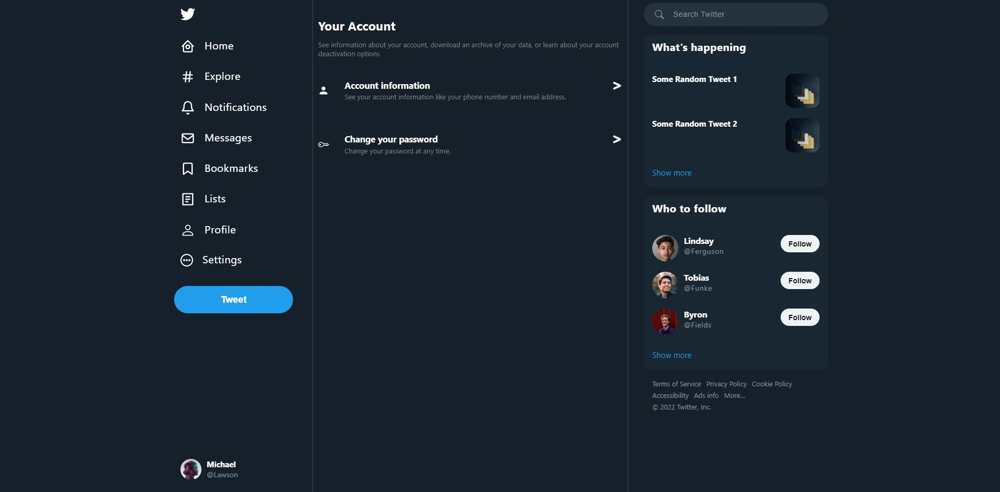

<!-- # Twitter Clone using React
### by Suraj Himanshu, Sachin, Abhishek

#### Dependencies

1. React
2. React Router Dom
3. React Redux
4. Redux
5. Axios
6. Fake REST API for data on heroku https://chirp-database.herokuapp.com/
7. Reduxjs Toolkit
 -->
<h1 align="center">Welcome to Chirp 👋</h1>

```
Twitter Clone using React
```

### by Abhishek, Sachin and Suraj Himanshu

<br/>


- This is a react clone of the Twitter website
- and it was made in 1 week.
- The technologies used are used because they are beginner friendly and easy to use.
- The project had some time constraints and most of the indepth features are still in progress.
- If you are interested in contributing to this project feel free to do so.

### 🏠 [Homepage](./public/twitterHome.jpg)

### ✨ [Demo](https://twitter-chirp.herokuapp.com/)

## Install

```sh
npm install
```

## Usage

```sh
npm run start
```

## Dependencies and Tech stack used

1. React
1. React Router Dom
1. Redux toolkit
1. Axios
1. REST API for data on heroku https://chirp-database.herokuapp.com/
1. React Icons
1. Styled Components
   <br/>
   <br/>
# Home


# Explore


# Profile


# Bookmarks


# Settings


---

<br/>


- Website: https://abhi-aro.herokuapp.com/


## Show your support

Give a ⭐️ if this project helped you!

---
